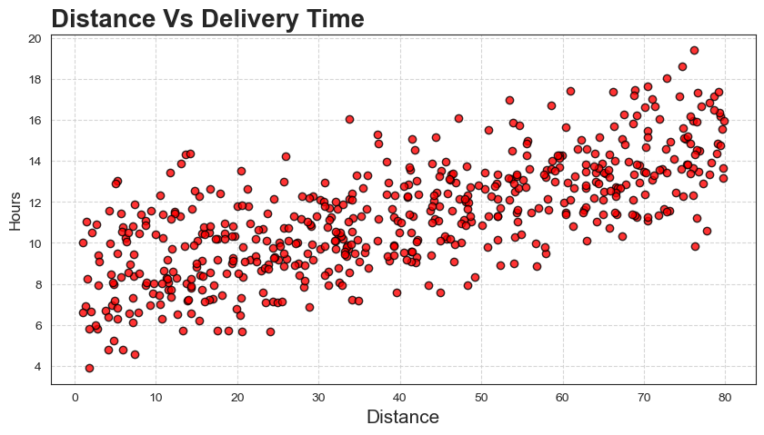
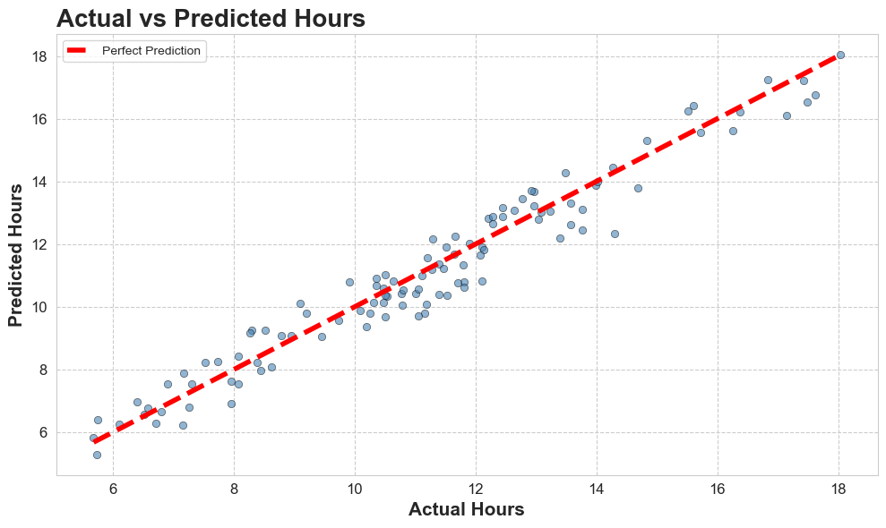

# 📦 Delivery Time Prediction

# 📌 Problem Statement

Predict delivery time based on factors like distance, traffic conditions, and order details to improve logistics efficiency.

# ⚙️ Approach

* Data cleaning and preprocessing
* Exploratory Data Analysis (EDA)
* Feature selection
* Linear Regression model building
* Model evaluation

# 📊 Key Visualizations
## Distance Vs Delivery Hours

## Actual vs Predicted Delivery Time

## 🔍 Insights

* Delivery time increases linearly with distance
* Traffic conditions significantly impact delays
* Model performs well for short-to-medium distances

# 🌍 Real-World Impact

Helps logistics companies:

* Optimize delivery routes
* Improve estimated delivery times (ETA)
* Enhance customer satisfaction
