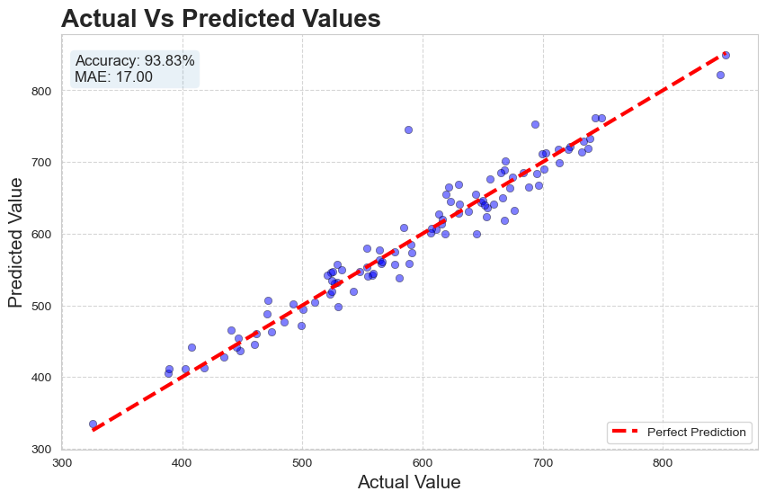
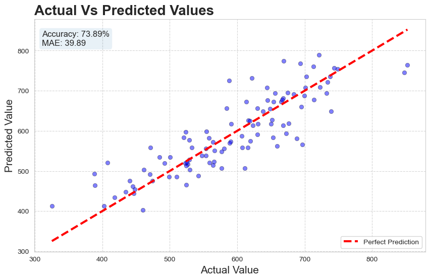
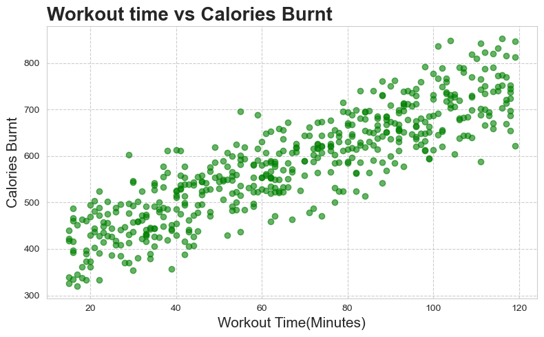

# 🔥 Gym Calories Prediction

# 📌 Problem Statement

Predict calories burned based on workout duration, intensity, and physical attributes.

# ⚙️ Approach

* Data cleaning
* Feature analysis (age, weight, duration)
* Linear Regression model
* Model evaluation

# 📊 Key Visualizations
## Model-1
 

 ## Model-2

## Workout Time Vs Calories Burned

# 🔍 Insights

* Workout duration strongly affects calorie burn
* Body weight influences total calories burned
* Intensity improves prediction accuracy

# 🌍 Real-World Impact

Helps:

* Fitness tracking apps
* Personalized workout planning
* Health monitoring systems
