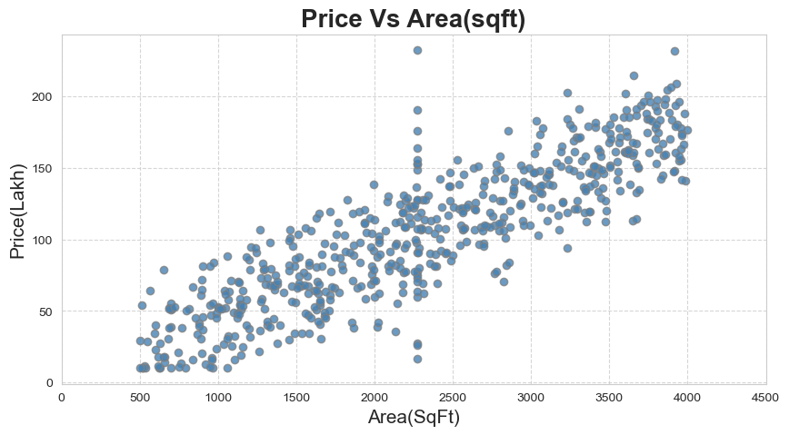
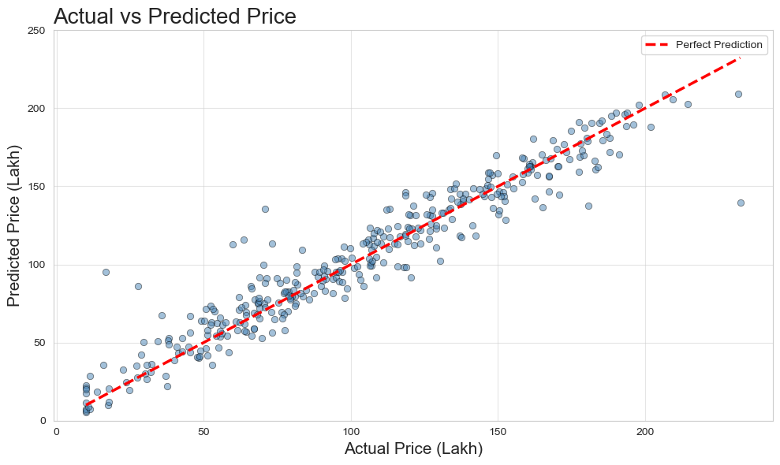

# 🏠 House Price Prediction

# 📌 Problem Statement

Predict house prices based on features like location, size, number of rooms, and amenities.

# ⚙️ Approach

* Data preprocessing
* Feature correlation analysis
* Linear Regression model
* Model evaluation

# 📊 Key Visualizations

## Area vs Price

## Predicted vs Actual Prices

# 🔍 Insights

* Area and location are key price drivers
* More rooms generally increase price
* Some features have minimal impact

# 🌍 Real-World Impact

Useful for:

* Real estate platforms
* Property valuation
* Investment decision-making
