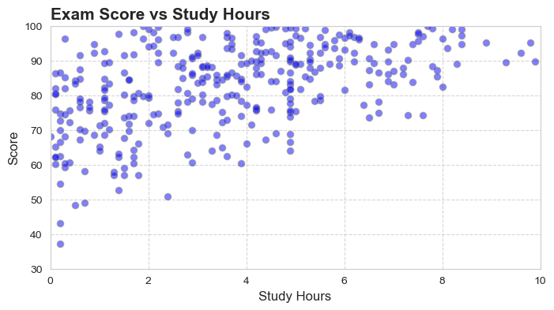
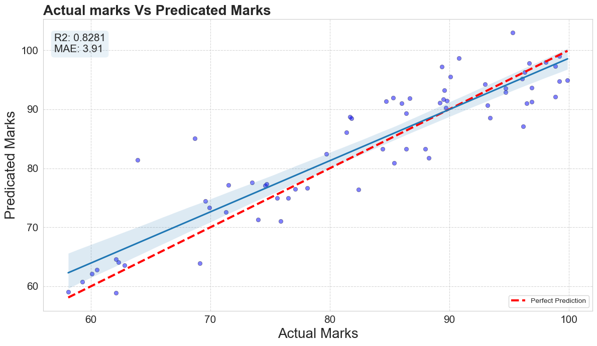

# 🎓 Student Score Prediction

# 📌 Problem Statement

Predict student performance based on study hours and other influencing factors.

# ⚙️ Approach

* Data cleaning
* Exploratory Data Analysis
* Linear Regression model
* Model evaluation

# 📊 Key Visualizations

## Study Hours vs Score

 
## Predicted vs Actual Scores

# 🔍 Insights

* Strong positive correlation between study time and scores
* Consistency matters more than intensity
* Model performs well on simple datasets

# 🌍 Real-World Impact

Helps:

* Students plan study time
* Educators identify performance trends
* EdTech platforms build recommendation systems
